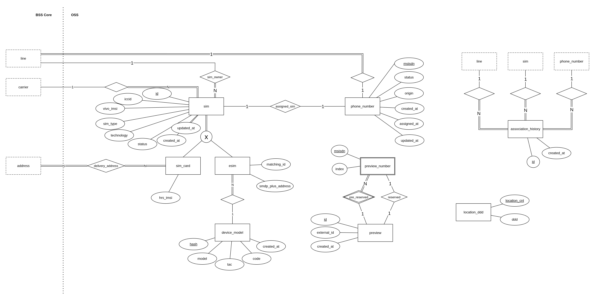

# OSS

Essas entidades representam os recursos de OSS (Operations Support System) como números de telefone, sim's (cartões de chip ou eSIMs), reservas de número, etc.

## Entidade `sim`

Entidade central que representa um SIM genérico, precisa ser especializada em `sim_card` (cartão) ou `esim` (embutido).

- **id**: Identificador artificial do SIM. Tipo: UUID.
- **iccid**: Identificador do SIM, não único devido a reuso de ICCIDs quando SIMs são desprogramados. Tipo: VARCHAR(64).
- **vivo_imsi**: "IMSI Real" retornado do GSIM. Faixa do International Mobile Subscriber Identity (IMSI) associada ao SIM. Tipo: VARCHAR(64).
- **sim_type**: Tipo do SIM, indicando se é `SIM_CARD` (cartão) ou `ESIM` (embutido). Tipo: VARCHAR(16)
- **technology**: Tecnologia suportada pelo SIM (ex: 4G, 5G NSA, 5G SA). Refere-se à tecnologia suportada pelo SIM, que pode limitar ou habilitar funcionalidades no dispositivo. Tipo: VARCHAR(16)
- **status**: Representa se o sim está ativo ou desprogramado. Tipo: VARCHAR(32)
- **created_at**: Data de criação do sim. Tipo: TIMESTAMP
- **updated_at**: Data de alteração do status do sim. Tipo: TIMESTAMP

## Entidade `sim_card` (especialização de `sim`)

Essa entidade representa um SIM Card

- **hrs_imsi**: "IMSI Fake" retornado da plataforma HRS (Habilitação Remota de SIM Cards). É substituído pelo IMSI Real da entidade `SIM` ao ser ativado. Tipo:VARCHAR(64)  

## Entidade `esim` (especialização de `sim`)

Esse entidade representa um SIM integrado ao dispositivo

- **matching_id**: Identificador único para associar o perfil eSIM a um dispositivo específico durante o provisionamento. Tipo: VARCHAR(64)
- **smdp_plus_address**: Endereço do servidor SMDP+ responsável pelo provisionamento e gerenciamento dos perfis eSIM. Tipo: VARCHAR(128).

## Entidade `device_model`

Um `device_model` representa uma escolha de dispositivo para eSIM com tecnologia adequada (4G, 5G NSA, 5G SA). Um `device_model` pode ser representado por:

- `tac`: Para instalação no "mesmo dispositivo" em dispositivos Android;
- `device_code`: Para instalação no "mesmo dispositivo" em dispositivos iOS;
- `device_model`: Para instalação em "outro dispositivo", independentemente do sistema;

Cada `device_model` terá um e apenas um desses campos preenchidos. A chave primária desta tabela será um campo `hash` que guarda os 32 primeiros caracteres hexadecimais do SHA-2 da string:

- Para TAC: `TAC:{{tac}}`
- Para device_code: `CODE:{{device_code}}`
- Para device_model: `MODEL:{{device_model}}`

Desta forma, uma escolha de dispositivo só terá um registro no banco (evitando duplicidades) que será relacionado com todas adesões que fizerem esta escolha.

A tabela `device_model` terá os seguintes campos:

- hash: `CHAR(32)`
- tac: `VARCHAR(128)`
- model: `VARCHAR(128)`
- code: `VARCHAR(128)`
- created_at: `TIMESTAMP`

## Entidade `phone_number`
Essa entidade que controla o número de telefone.

- **msisdn**: Número de telefone, chave natural. Tipo: CHAR(11)
- **origin**: Origem do número, indica se um número faz parte da pool da Vivo ou se veio de portabilidade em algum momento. Tipo: VARCHAR(32)  
- **status**: Estado do número (ex: em uso, reservado, pré-reservado, removido (liberado ou portado), etc.). Tipo: VARCHAR(32)
- **assigned_at**:  Data da última associação do número a uma linha. Tipo: TIMESTAMP
- **created_at**: Data de criação do número. Tipo: TIMESTAMP
- **updated_at**: Data da última alteração de status do número. Tipo: TIMESTAMP

## Entidade `preview`
Números em processo de escolha/pré-seleção fornecidos pelo SIGAN.

- **id**: Identificador único (UUID, não nulo), chave primária. Tipo: UUID
- **external_id**: Identificação dessa reserva na plataforma do SIGAN
- **created_at**: Data de criação da reserva. Tipo: TIMESTAMP

## Entidade `preview_number`
Entidade fraca que representa os números que poderão ser escolhidos.

- **msisdn**: chave primária da entidade`CHAR(11)`.
- **index**: número de 1 a 3 que representa qual das opções foi a escolhida. Tipo: `CHAR(1)` ou int

## Entidade `association_history`

Entidade que representa um histórico de associação entre número, sim e linha. Tabela contêm um campo `id`, chave primária serial; `msisdn`, FK para `phone_number.msisdn`; `sim_id`, FK para `sim.id`; `line_id`, FK para `line.id`; `created_at`, TIMESTAMP de criação.

## Entidade `location_ddd`

Entidade que mapeia o DDD de cada localização a partir de seu código (cnl). Contém o campo `location_cnl`, chave primária do tipo integer e o campo `ddd`, char(2);

## Relacionamentos

**bss_core.line x sim** (sim_owner): 1:N
Uma linha pode ter vários SIMs ao longo do tempo, mas cada SIM deve estar obrigatoriamente associado a uma linha.

**bss_core.carrier x sim**: 1:N
Indica a operadora dona deste SIM. O SIM deve, obrigatoriamente, pertencer uma operadora.

**bss_core.address x sim_card** (delivery_address): 1:N  
Um endereço pode receber vários SIM Cards, mas cada SIM Card deve estar vinculado a um endereço de entrega.

**esim x device_model**: N:1
Um eSIM precisa ser provisionado com base em um modelo de dispositivo para que ele tenha as tecnologias suportadas. Este relacionamento representa para qual modelo de dispositivo o eSIM foi emitido.

**sim x msisdn** (assigned_sim): 1:1  
Um SIM está associado a um único MSISDN, e vice-versa.

**line x msisdn**: 1:1  
Uma linha deve estar obrigatoriamente associada a um MSISDN, e cada MSISDN pode pertencer a somente um linha.

**preview_number x preview** (pre_reserved) N:1
Um preview_number precisa estar associado a um preview.

**preview_number x preview** (reserved) 1:1
Um preview será relacionado a um preview_number quando o usuário fizer a escolha.
